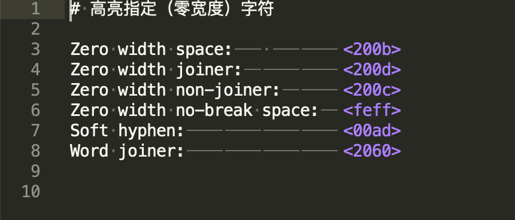

This plugin is modified from [Highlight Dodgy Chars](https://github.com/TuureKaunisto/highlight-dodgy-chars) in Sublime Text 3.

Main Features:
1. Customize the highlight color
2. The highlighted characters are modified to unicode encoding, similar to the effect in vim
3. Easy selection of special characters at the beginning of the line

# Highlight characters in Sublime Text 3

This plugin highlights custom characters. Its main purpose is to make zero-width characters visible (zero-width character set is configured by default).

By default the European special characters are whitelisted. The whitelisted characters can be edited in the settings.

`Sublime Text > Preferences > Package Settings > Highlight Custom Chars Unicode > Settings - User`

## Installing

The easiest way to install this plugin is with the **Package Control plugin** If you don't have Package Control installed, you can find instructions here: [https://packagecontrol.io/installation](https://packagecontrol.io/installation)

Once you've installed Package Control, restart Sublime and open the Command Palette (Command+Shift+p on OS X, Control+Shift+p on Linux/Windows). Type/select "Package Control: Install Package", wait while Package Control fetches the latest package list, then type/select `Highlight Custom Chars Unicode` when the list appears.